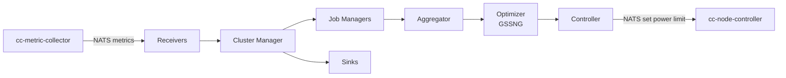

{}
Reference information regarding the ClusterCockpit component "cc-energy-manager" ([GitHub Repo](https://github.com/ClusterCockpit/cc-energy-manager "See GitHub")).
{}

## Overview

`cc-energy-manager` is a daemon that dynamically adjusts power limits on compute nodes of an HPC cluster to automatically optimize energy consumption. It is part of the [ClusterCockpit ecosystem](https://clustercockpit.org/) and integrates with [cc-metric-collector](https://github.com/ClusterCockpit/cc-metric-collector) for metrics and [cc-node-controller](https://github.com/ClusterCockpit/cc-node-controller) for applying power limit changes.

## Problem and Motivation

With large HPC systems, power draw is an ever-growing concern for grid infrastructure and environmental footprint. Modern CPUs and GPUs expose integrated power management that allows lowering maximum power limits (the opposite of overclocking). When a power limit is reduced, the chip's internal power management lowers clock speeds to stay within budget — reducing both power draw and performance.

The key observation is that performance does not decrease proportionally to power reduction. Efficiency (energy per unit of work) therefore improves, even on chips that are not running near their thermal limits. `cc-energy-manager` exploits this by continuously searching for the power limit that minimizes the **Energy Delay Product (EDP)** — a metric that balances energy savings against execution time increase, avoiding excessive slowdowns.

## How It Works

For each running job, `cc-energy-manager` performs a feedback-loop optimization:

1. **Measure**: Collect power draw and a *performance proxy* metric (e.g., instructions per second for CPUs, CUDA kernel counts for GPUs) from `cc-metric-collector` via NATS.
2. **Evaluate**: Compute the EDP for the current power limit.
3. **Search**: Use a **Golden Section Search** algorithm to find the power limit that minimizes EDP within configured bounds.
4. **Apply**: Send the new power limit to `cc-node-controller` via NATS, which applies it using RAPL (CPUs) or NVML (NVIDIA GPUs).

The search alternates between two intervals: a shorter `intervalSearch` during active exploration and a longer `intervalConverged` once the optimizer has found a stable minimum.

## Architecture

## Components

### Receivers

Accept metric messages from external sources (e.g., via NATS) as provided by `cc-metric-collector`. The receiver manager forwards all incoming messages to the Cluster Manager.

### Cluster Manager

The central orchestrator. It:

- Receives job start/stop events and creates or removes Job Managers accordingly.
- Routes incoming metrics to the correct Job Manager based on hostname and cluster membership.
- Filters jobs to only those matching the configured `partitionRegex`.
- Forwards processed metrics to the Sink Manager.

### Job Manager

Manages the optimization lifecycle for a single job. It supports three **optimization scopes**:

| Scope | Description |
|-------|-------------|
| `job` | One optimizer instance shared across all nodes and devices of the job |
| `node` | One optimizer per node; the resulting power limit is applied uniformly to all devices on that node |
| `device` | One independent optimizer per device (socket or GPU) on each node |

The Job Manager runs optimization ticks on a timer, switching between `intervalSearch` and `intervalConverged` based on the optimizer's convergence state.

### Aggregator

Collects power and performance metric samples from incoming messages and computes the EDP value fed into the optimizer. Two aggregation strategies are available:

- **`last`**: Uses the most recent metric value.
- **`median`**: Uses the median over a rolling time window.

The aggregator also supports multiple reduction modes when combining values across multiple devices (arithmetic mean, geometric mean, harmonic mean, min, max).

### Optimizer

Implements the **GSSNG** (Golden Section Search with Narrowing/Broadening) algorithm. It maintains four sample points within a search window and moves toward the EDP minimum. The window narrows when a minimum is found; it broadens when the current load appears insufficient to distinguish power limit effects.

The `gss` type is a plain Golden Section Search without the narrowing/broadening heuristic.

### Controller

Translates optimizer output into power limit commands sent to `cc-node-controller` via NATS. A separate NATS connection (using a `requestSubject` with a cluster-name placeholder `%c`) is created per cluster. The controller also caches node hardware topology information to map hardware threads to CPU sockets.

### Sinks

Receive the processed metrics output from the Cluster Manager and forward them to external systems for monitoring or storage (e.g., stdout, InfluxDB).

## Related Components

- **[cc-metric-collector](https://github.com/ClusterCockpit/cc-metric-collector)**: Collects per-node hardware performance and power metrics; the primary metrics source for cc-energy-manager.
- **[cc-node-controller](https://github.com/ClusterCockpit/cc-node-controller)**: Applies power limit changes on individual nodes via RAPL and NVML; receives commands from cc-energy-manager.
- **[cc-metric-store](https://github.com/ClusterCockpit/cc-metric-store)**: Optional long-term metric storage; not directly used by cc-energy-manager but part of the broader ClusterCockpit stack.
