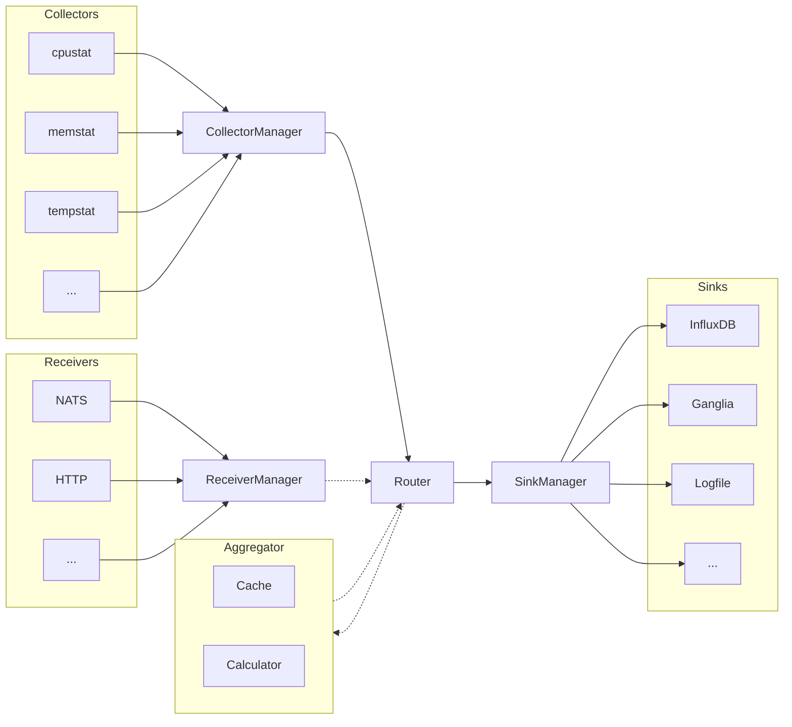
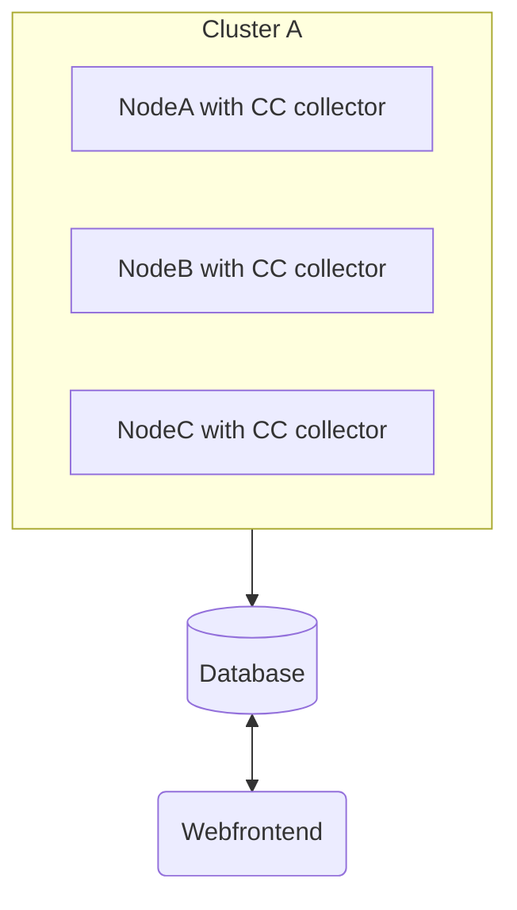
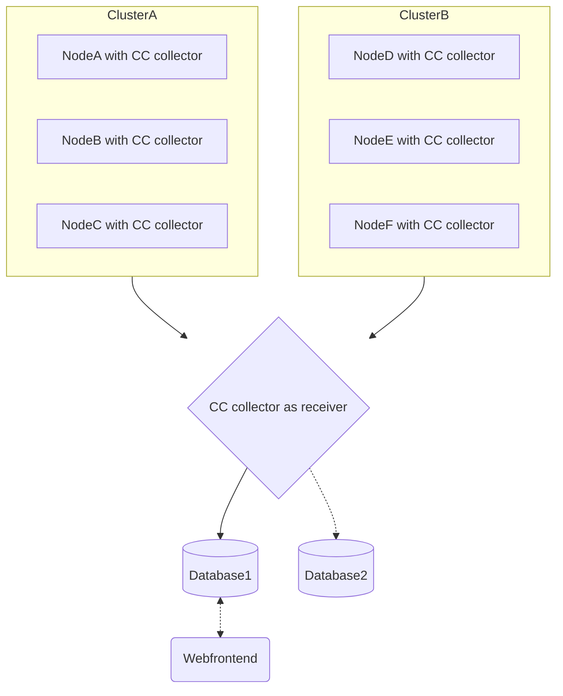

{}
Reference information regarding the ClusterCockpit component "cc-metric-collector" ([GitHub Repo](https://github.com/ClusterCockpit/cc-metric-collector "See GitHub")).
{}

## Overview

cc-metric-collector is a node agent for measuring, processing and forwarding node level metrics. It is part of the [ClusterCockpit ecosystem](https://clustercockpit.org/docs/overview/).

The metric collector sends (and receives) metrics in the [InfluxDB line protocol](https://docs.influxdata.com/influxdb/cloud/reference/syntax/line-protocol/) as it provides flexibility while providing a separation between tags (like index columns in relational databases) and fields (like data columns).

### Key Features

- **Modular Architecture**: Flexible plugin-based system with collectors, sinks, receivers, and router
- **Multiple Data Sources**: Collect metrics from various sources (procfs, sysfs, hardware libraries, custom commands)
- **Flexible Output**: Send metrics to multiple sinks simultaneously (InfluxDB, Prometheus, NATS, etc.)
- **On-the-fly Processing**: Router can tag, filter, aggregate, and transform metrics before forwarding
- **Network Receiver**: Accept metrics from other collectors to create hierarchical setups
- **Low Overhead**: Efficient serial collection with single timestamp per interval

### Architecture

There is a single timer loop that triggers all collectors serially, collects the data and sends the metrics to the configured sinks. This ensures all data is submitted with a single timestamp. The sinks currently use mostly blocking APIs.

The receiver runs as a go routine side-by-side with the timer loop and asynchronously forwards received metrics to the sink.

### Components

- **Collectors**: Read data from local system sources (files, commands, libraries) and send to router
- **Router**: Process metrics by caching, filtering, tagging, renaming, and aggregating
- **Sinks**: Send metrics to storage backends (InfluxDB, Prometheus, NATS, etc.)
- **Receivers**: Accept metrics from other collectors via network (HTTP, NATS) and forward to router

The key difference between collectors and receivers is that collectors are called periodically while receivers run continuously and submit metrics at any time.

## Supported Metrics

Supported metrics are documented in the [cc-specifications](https://github.com/ClusterCockpit/cc-specifications/blob/master/interfaces/lineprotocol/README.md).

## Deployment Scenarios

The metric collector was designed with flexibility in mind, so it can be used in many scenarios:

### Direct to Database

### Hierarchical Collection

## Links

- **GitHub Repository**: [ClusterCockpit/cc-metric-collector](https://github.com/ClusterCockpit/cc-metric-collector)
- **cc-backend**: [ClusterCockpit/cc-backend](https://github.com/ClusterCockpit/cc-backend)
- **cc-lib**: [ClusterCockpit/cc-lib](https://github.com/ClusterCockpit/cc-lib)
- **DOI**: [10.5281/zenodo.7438287](https://doi.org/10.5281/zenodo.7438287)
