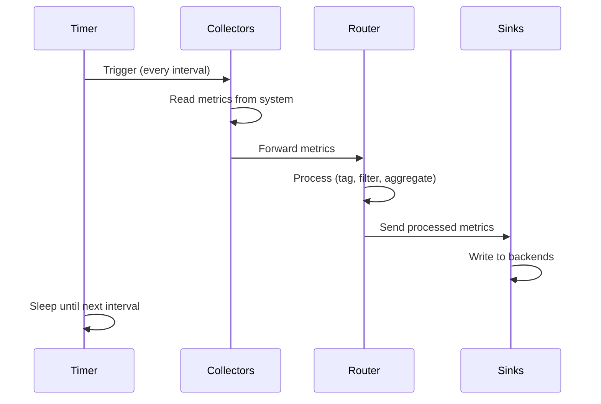

## Command Line Interface

### Basic Usage

```bash
cc-metric-collector [options]
```

### Command Line Options

| Flag       | Type   | Default          | Description                                    |
| ---------- | ------ | ---------------- | ---------------------------------------------- |
| `-config`  | string | `./config.json`  | Path to configuration file                     |
| `-log`     | string | `stderr`         | Path for logfile (use `stderr` for console)    |
| `-once`    | bool   | `false`          | Run all collectors only once then exit         |

### Examples

**Run with default configuration**:
```bash
cc-metric-collector
```

**Run with custom configuration**:
```bash
cc-metric-collector -config /etc/cc-metric-collector/config.json
```

**Log to file**:
```bash
cc-metric-collector -config /etc/cc-metric-collector/config.json \
                    -log /var/log/cc-metric-collector/collector.log
```

**Test configuration (run once)**:
```bash
cc-metric-collector -config /etc/cc-metric-collector/config.json -once
```

This runs all collectors exactly once and exits. Useful for:
- Testing configuration
- Debugging collector issues
- Validating metric output
- One-time metric collection

## Running as a Service

### Systemd

**Start service**:
```bash
sudo systemctl start cc-metric-collector
```

**Stop service**:
```bash
sudo systemctl stop cc-metric-collector
```

**Restart service**:
```bash
sudo systemctl restart cc-metric-collector
```

**Check status**:
```bash
sudo systemctl status cc-metric-collector
```

**View logs**:
```bash
journalctl -u cc-metric-collector -f
```

**Enable on boot**:
```bash
sudo systemctl enable cc-metric-collector
```

### SysVinit

**Start service**:
```bash
sudo /etc/init.d/cc-metric-collector start
```

**Stop service**:
```bash
sudo /etc/init.d/cc-metric-collector stop
```

**Restart service**:
```bash
sudo /etc/init.d/cc-metric-collector restart
```

**Check status**:
```bash
sudo /etc/init.d/cc-metric-collector status
```

## Operation Modes

### Daemon Mode (Default)

In daemon mode, cc-metric-collector runs continuously with a timer loop that:

1. Triggers all enabled collectors serially
2. Collects metrics with a single timestamp per interval
3. Forwards metrics through the router
4. Sends processed metrics to all configured sinks
5. Sleeps until the next interval

**Interval timing** is controlled by the `main.interval` configuration parameter.

### One-Shot Mode

Activated with the `-once` flag, this mode:

1. Initializes all collectors
2. Runs each collector exactly once
3. Processes and forwards metrics
4. Exits

Useful for:
- Configuration testing
- Debugging
- Cron-based metric collection
- Integration with other monitoring tools

## Metric Collection Flow



## Common Usage Patterns

### Basic Monitoring Setup

Collect basic system metrics and send to InfluxDB:

**config.json**:
```json
{
  "collectors-file": "./collectors.json",
  "sinks-file": "./sinks.json",
  "receivers-file": "./receivers.json",
  "router-file": "./router.json",
  "main": {
    "interval": "10s",
    "duration": "1s"
  }
}
```

**collectors.json**:
```json
{
  "cpustat": {},
  "memstat": {},
  "diskstat": {},
  "netstat": {},
  "loadavg": {}
}
```

**sinks.json**:
```json
{
  "influx": {
    "type": "influxasync",
    "host": "influx.example.org",
    "port": "8086",
    "organization": "myorg",
    "database": "metrics",
    "password": "mytoken"
  }
}
```

**router.json**:
```json
{
  "add_tags": [
    {
      "key": "cluster",
      "value": "production",
      "if": "*"
    }
  ],
  "interval_timestamp": true
}
```

**receivers.json**:
```json
{}
```

### HPC Node Monitoring

Extended monitoring for HPC compute nodes:

**collectors.json**:
```json
{
  "cpustat": {},
  "memstat": {},
  "diskstat": {},
  "netstat": {},
  "loadavg": {},
  "tempstat": {},
  "likwid": {
    "access_mode": "direct",
    "liblikwid_path": "/usr/local/lib/liblikwid.so",
    "eventsets": [
      {
        "events": {
          "cpu": ["FLOPS_DP", "CLOCK"]
        }
      }
    ]
  },
  "nvidia": {},
  "ibstat": {}
}
```

### Hierarchical Collection

**Compute nodes** send to aggregation node:

**Node config - sinks.json**:
```json
{
  "nats_aggregator": {
    "type": "nats",
    "host": "aggregator.example.org",
    "port": "4222",
    "subject": "cluster.rack1"
  }
}
```

**Aggregation node config - receivers.json**:
```json
{
  "nats_rack1": {
    "type": "nats",
    "address": "localhost",
    "port": "4222",
    "subject": "cluster.rack1"
  },
  "nats_rack2": {
    "type": "nats",
    "address": "localhost",
    "port": "4222",
    "subject": "cluster.rack2"
  }
}
```

**Aggregation node config - sinks.json**:
```json
{
  "influx": {
    "type": "influxasync",
    "host": "influx.example.org",
    "port": "8086",
    "organization": "myorg",
    "database": "metrics",
    "password": "mytoken"
  }
}
```

### Multi-Sink Configuration

Send metrics to multiple destinations:

**sinks.json**:
```json
{
  "primary_influx": {
    "type": "influxasync",
    "host": "influx1.example.org",
    "port": "8086",
    "organization": "myorg",
    "database": "metrics",
    "password": "token1"
  },
  "backup_influx": {
    "type": "influxasync",
    "host": "influx2.example.org",
    "port": "8086",
    "organization": "myorg",
    "database": "metrics",
    "password": "token2"
  },
  "prometheus": {
    "type": "prometheus",
    "host": "0.0.0.0",
    "port": "9091"
  }
}
```

## Monitoring and Debugging

### Check Collector Status

Use `-once` mode to test without running continuously:

```bash
cc-metric-collector -config /etc/cc-metric-collector/config.json -once
```

### Debug Output

Log to stderr for immediate feedback:

```bash
cc-metric-collector -config /etc/cc-metric-collector/config.json -log stderr
```

### Verify Metrics

Check what metrics are being collected:

1. Configure stdout sink temporarily
2. Run in `-once` mode
3. Observe metric output

**Temporary debug sink**:
```json
{
  "debug": {
    "type": "stdout"
  }
}
```

### Common Issues

**No metrics appearing**:
- Check collector configuration
- Verify collectors have required permissions
- Ensure sinks are reachable
- Check router isn't filtering metrics

**High CPU usage**:
- Increase `main.interval` value
- Disable expensive collectors
- Check for router performance issues

**Memory growth**:
- Reduce `num_cache_intervals` in router
- Check for sink write failures
- Verify metric cardinality isn't excessive

## Performance Tuning

### Interval Adjustment

**Faster updates** (more overhead):
```json
{
  "main": {
    "interval": "5s",
    "duration": "1s"
  }
}
```

**Slower updates** (less overhead):
```json
{
  "main": {
    "interval": "60s",
    "duration": "1s"
  }
}
```

### Collector Selection

Only enable collectors you need:

```json
{
  "cpustat": {},
  "memstat": {}
}
```

### Metric Filtering

Use router to exclude unwanted metrics:

```json
{
  "process_messages": {
    "manipulate_messages": [
      {
        "drop_by_name": ["cpu_idle", "cpu_iowait"]
      }
    ]
  }
}
```

## Security Considerations

### Running as Non-Root

Most collectors work without root privileges, except:
- LIKWID (direct mode)
- IPMI collector
- Some hardware-specific collectors

Use capabilities instead of root when possible.

### Network Security

When using receivers:
- Use authentication (NATS credentials, HTTP tokens)
- Restrict listening addresses
- Use TLS for encrypted transport
- Firewall receiver ports appropriately

### File Permissions

Protect configuration files containing credentials:

```bash
sudo chmod 600 /etc/cc-metric-collector/config.json
sudo chown cc-metric-collector:cc-metric-collector /etc/cc-metric-collector/config.json
```
