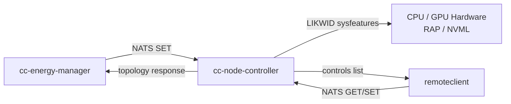

{}
Reference information regarding the ClusterCockpit component "cc-node-controller" ([GitHub Repo](https://github.com/ClusterCockpit/cc-node-controller "See GitHub")).
{}

## Overview

`cc-node-controller` is a daemon that runs on each compute node of an HPC cluster. It subscribes to a [NATS](https://nats.io/) messaging subject and applies hardware-level control operations — such as setting CPU power limits via RAPL or adjusting GPU power limits via NVML — using the [LIKWID](https://github.com/RRZE-HPC/likwid) sysfeatures library. It is the enforcement layer in the ClusterCockpit energy optimization stack: [cc-energy-manager](https://github.com/ClusterCockpit/cc-energy-manager) computes optimal power limits and sends them to `cc-node-controller` for application.

## Architecture



## How It Works

On startup, `cc-node-controller`:

1. Initializes the LIKWID sysfeatures subsystem (reads CPU topology from sysfs, loads hardware access libraries).
2. Reads the configuration file and connects to the NATS server.
3. Subscribes to the configured `requestSubject`.
4. Enters a message loop, processing incoming control messages.

Each message is processed only if its `hostname` tag matches the node's own short hostname — messages directed at other nodes are silently ignored, allowing all nodes in a cluster to share a single NATS subject.

Shutdown is triggered by `SIGTERM` or `SIGINT`.

## NATS Message API

Messages use the [ClusterCockpit line protocol](https://github.com/ClusterCockpit/cc-specifications) format. The daemon handles three message types, identified by message name.

### `topology`

Returns the hardware topology of the node.

**Required tags:**

| Tag | Value |
|-----|-------|
| `hostname` | Target node hostname |
| `method` | `GET` |
| `type` | `node` |
| `type-id` | `0` |

**Response:** A log message with `level=INFO` whose value is a JSON object:

```json
{
  "hwthreads": [
    { "cpu_id": 0, "socket": 0, "die": 0, "core": 0, "numa_domain": 0, "smt_id": 0 },
    ...
  ],
  "cpu_info": {
    "num_hwthreads": 128,
    "smt_width": 2,
    "num_sockets": 2,
    "num_dies": 2,
    "num_cores": 64,
    "num_numa_domains": 8
  }
}
```

### `controls`

Returns the list of hardware controls available on the node, as enumerated by LIKWID sysfeatures.

**Required tags:** same as `topology` (`hostname`, `method=GET`, `type=node`, `type-id=0`)

**Response:** A log message with `level=INFO` whose value is a JSON object:

```json
{
  "controls": [
    {
      "category": "rapl",
      "name": "pkg_power_limit1",
      "device_type": "socket",
      "description": "RAPL package power limit 1",
      "methods": "ALL"
    },
    {
      "category": "cpu_freq",
      "name": "cur_cpu_freq",
      "device_type": "hwthread",
      "description": "Current CPU frequency",
      "methods": "GET"
    }
  ]
}
```

The full control name used in GET/PUT requests is `<category>.<name>` (e.g. `rapl.pkg_power_limit1`).

### `<control_name>` (GET / PUT)

Reads or writes a specific hardware control value.

**Required tags:**

| Tag | Value |
|-----|-------|
| `hostname` | Target node hostname |
| `method` | `GET` or `PUT` |
| `type` | Device type (see [Device Types](#device-types)) |
| `type-id` | Device ID (integer as string, e.g. `"0"`) |

For `PUT` requests the message must also carry the control value field.

**Response:** A log message with tag `level=INFO` on success (value contains the result for GET) or `level=ERROR` on failure (value contains the error description).

**Examples:**

```
# GET: read RAPL package power limit on socket 0
rapl.pkg_power_limit1,hostname=node01,method=GET,type=socket,type-id=0 1234567890

# PUT: set RAPL package power limit on socket 0 to 150W
rapl.pkg_power_limit1,hostname=node01,method=PUT,type=socket,type-id=0 value="150" 1234567890
```

## Device Types

| Type | Description |
|------|-------------|
| `node` | Whole node / system level |
| `hwthread` | Logical CPU / hardware thread |
| `core` | Physical CPU core |
| `socket` | CPU socket / package |
| `die` | CPU die |
| `memoryDomain` | NUMA domain |

The available device types for any given control are reported in the `device_type` field of the `controls` response.

## Dependencies

- **LIKWID** v5.5.0 or newer, compiled with `BUILD_SYSFEATURES=true`. The shared library `liblikwid.so` must be available at runtime (set `LD_LIBRARY_PATH` if installed to a non-standard path).
- **NATS server** accessible from every compute node.

## Related Components

- **[cc-energy-manager](https://github.com/ClusterCockpit/cc-energy-manager)**: Computes optimal power limits and sends SET commands to `cc-node-controller`. Also queries topology to map hardware threads to CPU sockets.
- **[cc-metric-collector](https://github.com/ClusterCockpit/cc-metric-collector)**: Collects per-node hardware metrics (power consumption, instruction rate, etc.) forwarded to cc-energy-manager for optimization decisions.
- **[LIKWID](https://github.com/RRZE-HPC/likwid)**: Provides the sysfeatures abstraction layer for hardware control access.
