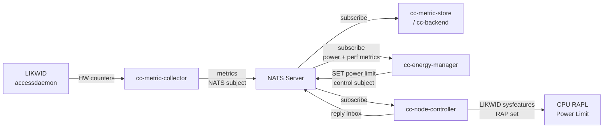

## Introduction

This tutorial extends a base ClusterCockpit installation (as set up in the
earlier tutorials) with automated **CPU power limit optimization** using
[cc-energy-manager](https://github.com/ClusterCockpit/cc-energy-manager) and
[cc-node-controller](https://github.com/ClusterCockpit/cc-node-controller).

The energy manager continuously monitors the power draw and compute performance
of running jobs and uses a Golden Section Search algorithm to find the CPU
socket power limit that minimizes the **Energy Delay Product (EDP)** — a
balanced metric that saves energy without proportionally reducing performance.
The node controller receives those power limit commands and applies them via the
LIKWID sysfeatures interface to the hardware RAPL power management unit.

**Prerequisites:**

- A working ClusterCockpit installation with NATS, `cc-metric-collector`, and
  `cc-backend` deployed as described in the
  [installation manual]().
- Intel CPUs with RAPL (Running Average Power Limit) support on the compute
  nodes.
- [LIKWID](https://github.com/RRZE-HPC/likwid) v5.5.0 or newer installed on
  all compute nodes, compiled with `BUILD_SYSFEATURES=true`.

## Architecture



`cc-metric-collector` and `cc-node-controller` run on **each compute node**.
`cc-energy-manager` runs on the **frontend/monitoring node** alongside the rest
of the ClusterCockpit stack. The NATS server is the only shared communication
channel between them.

## NATS Configuration

The energy optimization components require two new NATS users and a dedicated
**control subject** in addition to the existing metrics subject.

Add the following permission definitions and users to `/etc/nats-server.conf`.
The convention used here is `<metrics-subject>_control` for the control subject
(e.g. if your metrics subject is `mycluster`, the control subject is
`mycluster_control`).

```conf
# Permission definitions — add alongside existing ones
NODE_CONTROLLER: {
    publish:   { allow: "_INBOX.>" }
    subscribe: { allow: "<metrics-subject>_control" }
}
ENERGY_MANAGER: {
    publish:   { allow: "<metrics-subject>_control" }
    subscribe: { allow: [ "<metrics-subject>", "_INBOX.>" ] }
}

# Add to the users list
{ user: "node-controller",  password: "<password>", permissions: $NODE_CONTROLLER }
{ user: "energy-manager",   password: "<password>", permissions: $ENERGY_MANAGER }
```

The `energy-manager` user subscribes to the metrics subject to receive power
and performance data, and publishes to the control subject to send power limit
commands. The `node-controller` user does the reverse.

After editing the configuration, reload NATS:

```bash
systemctl reload nats-server
```

## Compute Node Setup

The following steps are performed on **every compute node** that will be managed
by the energy optimizer.

### MSR Kernel Module

LIKWID requires access to the CPU's Model-Specific Registers (MSRs) for
hardware counter and RAPL access:

```bash
echo "msr" > /etc/modules-load.d/msr.conf
modprobe msr
```

### LIKWID Lock File Permissions

LIKWID uses a lock file (`/var/run/likwid.lock`) to coordinate access to the
hardware counters. Both `cc-metric-collector` and `cc-node-controller` need
access to this file. Create a systemd oneshot service that sets up the lock file
before either daemon starts:

```ini
# /etc/systemd/system/cc-likwid-perms.service
[Unit]
Description=Setup LIKWID lock file

[Service]
User=root
Type=oneshot
ExecStart=touch /var/run/likwid.lock
ExecStart=chown cc-metric-collector: /var/run/likwid.lock
ExecStart=setfacl -m u:cc-metric-collector:r /var/run/likwid.lock
ExecStart=setfacl -m u:cc-node-controller:r /var/run/likwid.lock
SyslogIdentifier=cc-likwid-perms
```


The `setfacl` command requires the `acl` package (`apt install acl`). Also,
`cc-node-controller` must run as the **same user** as `cc-metric-collector` so
they share the same LIKWID lock context. See the service file below.


Enable and start the service:

```bash
systemctl daemon-reload
systemctl enable --now cc-likwid-perms.service
```

### cc-metric-collector: Energy Metrics

`cc-metric-collector` must be configured to collect the two metrics
`cc-energy-manager` needs:

- **`cpu_power`** (Watts, per socket) — the power proxy
- **`gips`** (giga-instructions per second, per hwthread) — the performance
  proxy

Both are derived from hardware counters via the `likwid` collector. Add the
following two collectors to `collectors.json`:

```json
{
  "rapl": {},
  "likwid": {
    "force_overwrite": true,
    "invalid_to_zero": true,
    "liblikwid_path": "/path/to/liblikwid.so",
    "access_mode": "accessdaemon",
    "accessdaemon_path": "/path/to/likwid/sbin",
    "lockfile_path": "/run/likwid.lock",
    "eventsets": [
      {
        "events": {
          "FIXC0": "INSTR_RETIRED_ANY",
          "FIXC1": "CPU_CLK_UNHALTED_CORE",
          "FIXC2": "CPU_CLK_UNHALTED_REF",
          "MBOX0C0": "CAS_COUNT_RD",
          "MBOX0C1": "CAS_COUNT_WR",
          "MBOX1C0": "CAS_COUNT_RD",
          "MBOX1C1": "CAS_COUNT_WR",
          "MBOX2C0": "CAS_COUNT_RD",
          "MBOX2C1": "CAS_COUNT_WR",
          "MBOX3C0": "CAS_COUNT_RD",
          "MBOX3C1": "CAS_COUNT_WR",
          "PMC0": "FP_ARITH_INST_RETIRED_128B_PACKED_DOUBLE",
          "PMC1": "FP_ARITH_INST_RETIRED_SCALAR_DOUBLE",
          "PMC2": "FP_ARITH_INST_RETIRED_256B_PACKED_DOUBLE",
          "PWR0": "PWR_PKG_ENERGY",
          "PWR3": "PWR_DRAM_ENERGY"
        },
        "metrics": [
          {
            "calc": "1E-6*(FIXC1/FIXC2)/inverseClock",
            "name": "clock", "unit": "MHz",
            "type": "hwthread", "publish": true
          },
          {
            "calc": "FIXC0/FIXC1",
            "name": "ipc",
            "type": "hwthread", "publish": true,
            "send_socket_total_values": true
          },
          {
            "calc": "FIXC0/time/1000000000",
            "name": "gips",
            "type": "hwthread", "publish": true,
            "send_socket_total_values": true
          },
          {
            "calc": "PWR0/time",
            "name": "cpu_power", "unit": "Watt",
            "type": "socket", "publish": true
          },
          {
            "calc": "PWR0",
            "name": "cpu_energy", "unit": "Joules",
            "type": "socket", "publish": true
          },
          {
            "calc": "PWR3/time",
            "name": "mem_power", "unit": "Watt",
            "type": "socket", "publish": true
          },
          {
            "calc": "1E-9*(MBOX0C0+MBOX1C0+MBOX2C0+MBOX3C0+MBOX0C1+MBOX1C1+MBOX2C1+MBOX3C1)*64.0/time",
            "name": "mem_bw", "unit": "GBytes/s",
            "type": "socket", "publish": true
          }
        ]
      }
    ]
  }
}
```

The NATS sink (`sinks.json`) publishes these metrics to the same subject that
`cc-energy-manager` subscribes to — no change is needed there if you already
followed the [cc-metric-collector setup]().

### cc-node-controller

Install the `cc-node-controller` binary on each compute node, e.g. at
`/opt/cc-node-controller/cc-node-controller`.

Create the configuration file `/opt/cc-node-controller/config.json`:

```json
{
    "server": "<frontend-hostname>",
    "port": 4222,
    "user": "node-controller",
    "password": "<node-controller-nats-password>",
    "requestSubject": "<metrics-subject>_control"
}
```

Create the systemd service `/etc/systemd/system/cc-node-controller.service`:

```ini
[Unit]
Description=cc-node-controller
Requires=cc-likwid-perms.service
After=cc-likwid-perms.service
Wants=network.target
After=network.target

[Service]
# Must run as the same user as cc-metric-collector to share LIKWID lock access
User=cc-metric-collector
Type=simple
ExecStart=/opt/cc-node-controller/cc-node-controller -loglevel warn
WorkingDirectory=/opt/cc-node-controller
SyslogIdentifier=cc-node-controller
Restart=on-failure
RestartSec=15s
Environment=LD_LIBRARY_PATH=/path/to/likwid/lib

ProtectSystem=strict
PrivateTmp=true
ProtectControlGroups=true
ProtectHome=true
TemporaryFileSystem=/var
BindPaths=/var/run
TemporaryFileSystem=/opt
BindPaths=/opt/cc-node-controller

[Install]
WantedBy=multi-user.target
```


`cc-node-controller` must run under the **same system user** as
`cc-metric-collector`. LIKWID's lock file grants access per user; running as a
separate user would cause LIKWID initialization to fail. Set `User=` to
whichever user your `cc-metric-collector` service uses.


Enable and start the service:

```bash
systemctl daemon-reload
systemctl enable --now cc-node-controller.service
```

Verify it started successfully:

```bash
systemctl status cc-node-controller.service
journalctl -u cc-node-controller.service
```

## Frontend: cc-energy-manager

Install the `cc-energy-manager` binary on the monitoring frontend, e.g. at
`/opt/cc-energy-manager/cc-energy-manager`.

Create a system user and the working directory:

```bash
useradd --system --no-create-home --shell /usr/sbin/nologin cc-energy-manager
mkdir -p /opt/cc-energy-manager/trace
chown cc-energy-manager: /opt/cc-energy-manager/trace
```

### Configuration

Create `/opt/cc-energy-manager/config.json`. There are four required sections:

**Receivers** — subscribe to the NATS metrics stream:

```json
"receivers": {
    "nats": {
        "type": "nats",
        "address": "<frontend-hostname>",
        "port": "4222",
        "subject": "<metrics-subject>",
        "user": "energy-manager",
        "password": "<energy-manager-nats-password>"
    }
}
```

**Sinks** — forward processed metrics (adjust to match your setup):

```json
"sinks": {
    "stdout": {
        "type": "stdout",
        "meta_as_tags": []
    }
}
```

**Controller** — connect to `cc-node-controller` via NATS for sending power
limit commands:

```json
"controller": {
    "nats": {
        "server": "<frontend-hostname>",
        "port": 4222,
        "user": "energy-manager",
        "password": "<energy-manager-nats-password>",
        "requestSubject": "%c_control"
    }
}
```

The `%c` placeholder in `requestSubject` is replaced at runtime with the
cluster name from the `clusters` configuration below, producing e.g.
`mycluster_control`.

**Clusters** — the optimizer configuration. The cluster `name` must match the
`cluster` tag present in metric messages (set by cc-metric-collector's router
configuration):

```json
"clusters": [
    {
        "name": "<metrics-subject>",
        "powerBudgetTotal": 500,
        "partitionRegex": "^eehpc$",
        "subclusters": [
            {
                "name": "main",
                "hostRegex": "^node\\d+$",
                "devicetypes": {
                    "socket": {
                        "scope": "job",
                        "aggregator": {
                            "type": "median",
                            "powerMetric": "cpu_power",
                            "performanceMetric": "gips",
                            "deviceType": "socket"
                        },
                        "controlName": "rapl.pkg_limit_1",
                        "controlDefaultValue": 85,
                        "intervalConverged": "60s",
                        "intervalSearch": "60s",
                        "optimizer": {
                            "type": "gssng",
                            "tolerance": 2,
                            "borders": {
                                "lower": 30,
                                "upper": 85
                            }
                        }
                    }
                }
            }
        ]
    }
]
```

Key configuration decisions:

| Parameter | Value | Description |
|-----------|-------|-------------|
| `powerBudgetTotal` | 500 W | Total cluster power budget in watts |
| `partitionRegex` | `^eehpc$` | Only optimize jobs on this Slurm partition |
| `scope` | `job` | One optimizer per job (shared across all job nodes) |
| `powerMetric` | `cpu_power` | Per-socket power in Watts from LIKWID |
| `performanceMetric` | `gips` | Giga-instructions/s from LIKWID |
| `controlName` | `rapl.pkg_limit_1` | LIKWID sysfeatures RAPL control name |
| `controlDefaultValue` | 85 W | Power limit applied when no job is running |
| `borders.lower` | 30 W | Minimum power limit the optimizer may set |
| `borders.upper` | 85 W | Maximum power limit (= hardware default) |
| `tolerance` | 2 W | Convergence threshold — stop searching within ±2 W |

### Systemd Service

Create `/etc/systemd/system/cc-energy-manager.service`:

```ini
[Unit]
Description=cc-energy-manager
Wants=network.target
After=network.target

[Service]
User=cc-energy-manager
Type=simple
ExecStart=/opt/cc-energy-manager/cc-energy-manager -loglevel warn
WorkingDirectory=/opt/cc-energy-manager
SyslogIdentifier=cc-energy-manager
Restart=on-failure
RestartSec=15s

ProtectSystem=strict
NoNewPrivileges=true
PrivateTmp=true
PrivateDevices=true
ProtectKernelTunables=true
ProtectControlGroups=true
ProtectHome=true
TemporaryFileSystem=/var
TemporaryFileSystem=/opt
BindPaths=/opt/cc-energy-manager

[Install]
WantedBy=multi-user.target
```

Enable and start the service:

```bash
systemctl daemon-reload
systemctl enable --now cc-energy-manager.service
```

## Slurm Partition for Energy-Efficient Jobs

The `partitionRegex` in cc-energy-manager restricts optimization to jobs
submitted to a dedicated Slurm partition. This is an opt-in mechanism: only
users who explicitly choose the energy-efficient partition have their jobs power
managed.

Create the Slurm partition:

```bash
scontrol create partition=eehpc nodes=node[01-03] \
    default=no state=up maxtime=INFINITE
```

Users submit jobs to this partition with:

```bash
sbatch --partition=eehpc job.sh
```

Jobs on all other partitions continue to run at the `controlDefaultValue` (full
power).

## Verification

**1. Confirm cc-node-controller can access RAPL controls:**

Use the `remoteclient` utility from the cc-node-controller repository to query
a compute node directly:

```bash
./remoteclient -host node01 -server <frontend> -request-subject <metrics-subject>_control -list
```

You should see `rapl.pkg_limit_1` listed with `methods: ALL`.

**2. Check the current RAPL power limit:**

```bash
./remoteclient -host node01 -server <frontend> \
    -request-subject <metrics-subject>_control \
    -get rapl.pkg_limit_1@socket-0
```

**3. Monitor cc-energy-manager in real time:**

Submit a job to the `eehpc` partition and watch the optimizer:

```bash
sbatch --partition=eehpc --ntasks=20 job.sh
journalctl -fu cc-energy-manager
```

Log output will show when a job is picked up, which power limit is being probed,
and when the optimizer converges.

**4. Verify power limits are changing:**

After the optimizer has run for a few intervals, re-query the power limit:

```bash
./remoteclient -host node01 -server <frontend> \
    -request-subject <metrics-subject>_control \
    -get rapl.pkg_limit_1@socket-0
```

The value should differ from the `controlDefaultValue` if the optimizer found a
better operating point.

**5. View job metrics in cc-backend:**

Once the job completes, open the job detail view in the cc-backend web interface.
The `cpu_power` and `gips` time series show how power consumption and
performance evolved as the optimizer adjusted the limits.

## Common Issues

**cc-node-controller fails to initialize LIKWID:**
- Ensure `msr` kernel module is loaded (`lsmod | grep msr`)
- Check `LD_LIBRARY_PATH` points to the correct `liblikwid.so`
- Verify `cc-likwid-perms.service` ran successfully before the service started
- Confirm `cc-node-controller` runs as the same user as `cc-metric-collector`

**cc-energy-manager logs "no job found" for all incoming jobs:**
- Check that the cluster `name` in config matches the `cluster` tag on incoming
  metrics (see cc-metric-collector router configuration)
- Verify the Slurm partition name matches `partitionRegex` exactly

**Power limits are set but no performance difference is observed:**
- Confirm `borders.lower` is meaningfully below `borders.upper` (at least 20–30 W
  difference to see effects)
- Check that `gips` values are non-zero in the metric stream — a
  memory-bandwidth-bound application may have very low IPS, causing the
  optimizer to reach the lower bound quickly
